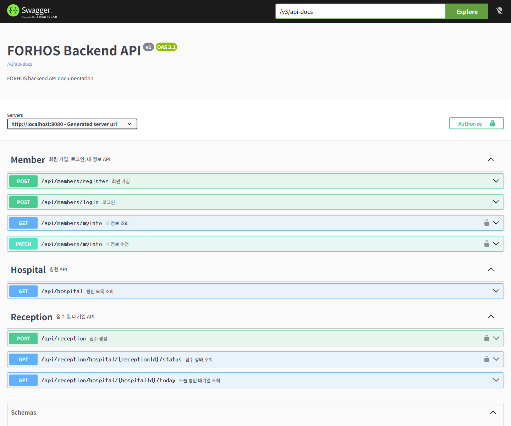

# FORHOS Backend

> 병원 방문 전 대기 현황을 확인하고, 진료 접수와 사용자 정보를 안전하게 관리하기 위한 병원 대기 관리 서비스 백엔드입니다.

- Backend Repository: <https://github.com/jinkong9/FORHOS_Backend>
- Frontend Repository: <https://github.com/jinkong9/FORHOS>
- 주요 담당 범위: REST API, JWT 인증, 회원/병원/접수 도메인, 대기열 계산, 관리자 접수 관리, Swagger 문서화

---

## 프로젝트 소개

FORHOS Backend는 병원 대기 관리 서비스의 서버 애플리케이션입니다.

사용자는 회원가입과 로그인을 통해 서비스를 이용할 수 있고, 병원 목록을 조회한 뒤 진료 접수를 신청할 수 있습니다. 접수 후에는 자신의 접수 상태와 내 앞 대기 인원을 확인할 수 있도록 API를 제공합니다.

이 프로젝트는 프론트엔드에서 필요한 병원 목록, 회원 정보, 진료 접수, 대기 상태 데이터를 REST API로 제공하는 것을 목표로 설계했습니다.

---

## 해결하고자 한 문제

| 문제 | 백엔드 해결 방향 |
| --- | --- |
| 병원 방문 전 대기 현황 확인 어려움 | 병원별 오늘 접수 목록 조회 API 제공 |
| 진료 접수 데이터 관리 필요 | 회원과 병원을 연결한 접수 생성 API 제공 |
| 사용자 정보 반복 입력 | 회원 정보 조회 및 수정 API 제공 |
| 접수 상태 확인 필요 | 본인 접수 상태 및 앞 대기 인원 조회 API 제공 |
| 인증된 사용자만 접수 가능 | JWT 기반 인증 필터 적용 |
| 민감한 사용자 정보 보호 필요 | 비밀번호 BCrypt 암호화 및 본인 접수 검증 |
| 병원 관리자 업무 필요 | 접수 호출, 완료, 취소 API 제공 |

---

## 주요 기능

- 회원가입
- 로그인 및 JWT 발급
- refresh token 기반 JWT 재발급
- 로그아웃 시 인증 쿠키 만료
- 내 정보 조회
- 내 정보 수정
- 병원 목록 조회
- 병원 상세 조회
- 진료 접수 생성
- 병원별 오늘 접수 목록 조회
- 내 접수 상태 조회
- 내 최신 진행 접수 상태 조회
- 내 접수 목록 조회
- 내 접수 취소
- 병원 관리자용 오늘 접수 목록 조회
- 병원 관리자용 접수 호출 / 완료 / 취소
- JWT 인증 필터 적용
- 역할 기반 관리자 API 접근 제어
- 전역 예외 응답 처리
- Swagger / OpenAPI 문서 제공

---

## 기술 스택

| Category | Tech |
| --- | --- |
| Language | Java 21 |
| Framework | Spring Boot 4.0.6 |
| Web | Spring Web MVC |
| ORM | Spring Data JPA, Hibernate |
| Database | MySQL |
| Test Database | H2 |
| Security | Spring Security, JWT |
| Validation | Jakarta Validation |
| API Docs | Springdoc OpenAPI, Swagger UI |
| Build Tool | Gradle |
| Utility | Lombok |

---

## Backend Architecture

```text
src
├─ main
│  ├─ java
│  │  └─ com.jin.practice
│  │     ├─ common
│  │     ├─ config
│  │     ├─ Security
│  │     ├─ util
│  │     ├─ auth
│  │     ├─ member
│  │     ├─ hospital
│  │     └─ reception
│  └─ resources
└─ test
```

| 폴더 | 역할 |
| --- | --- |
| `common` | 공통 에러 응답과 전역 예외 처리 |
| `config` | Security, CORS, OpenAPI 등 애플리케이션 설정 |
| `Security` | JWT 인증 필터 |
| `auth` | refresh token 재발급 API |
| `member` | 회원가입, 로그인, 로그아웃, 내 정보 관리 |
| `hospital` | 병원 목록과 병원 상세 조회 |
| `reception` | 진료 접수, 대기열, 접수 상태, 관리자 접수 관리 |

도메인별로 Controller, Service, Repository, DTO, Entity를 분리했습니다. Controller는 HTTP 요청과 응답을 담당하고, Service는 인증 사용자 기준 조회, 접수 생성, 대기 번호 계산, 상태 변경 같은 비즈니스 로직을 담당합니다.

---

## API 명세

### Auth

| Method | URL | 설명 | 인증 |
| --- | --- | --- | --- |
| `POST` | `/api/auth/refresh` | refresh token 검증 후 새 JWT 발급 | Refresh Token |

### Member

| Method | URL | 설명 | 인증 |
| --- | --- | --- | --- |
| `POST` | `/api/members/register` | 회원가입 | No |
| `POST` | `/api/members/login` | 로그인 및 JWT 발급 | No |
| `POST` | `/api/members/logout` | 인증 쿠키 만료 | No |
| `GET` | `/api/members/myinfo` | 내 정보 조회 | Yes |
| `PATCH` | `/api/members/myinfo` | 내 정보 수정 | Yes |

### Hospital

| Method | URL | 설명 | 인증 |
| --- | --- | --- | --- |
| `GET` | `/api/hospital` | 병원 목록 조회 | No |
| `GET` | `/api/hospital/{hospitalId}` | 병원 상세 조회 | No |

### Reception

| Method | URL | 설명 | 인증 / 권한 |
| --- | --- | --- | --- |
| `POST` | `/api/reception` | 진료 접수 생성 | 로그인 사용자 |
| `GET` | `/api/reception/hospital/{hospitalId}/today` | 병원별 오늘 접수 목록 조회 | 로그인 사용자 |
| `GET` | `/api/reception/hospital/{receptionId}/status` | 특정 접수 상태 및 앞 대기 인원 조회 | 본인 접수 |
| `GET` | `/api/reception/me` | 내 접수 이력 조회 | 로그인 사용자 |
| `GET` | `/api/reception/me/latest` | 내 최신 진행 접수 상태 조회 | 로그인 사용자 |
| `PATCH` | `/api/reception/{receptionId}/cancel` | 내 접수 취소 | 본인 접수 |
| `PATCH` | `/api/reception/{receptionId}/call` | 접수 호출 | `HOSPITAL_ADMIN`, `ADMIN` |
| `PATCH` | `/api/reception/{receptionId}/complete` | 접수 완료 | `HOSPITAL_ADMIN`, `ADMIN` |

### Admin Reception

| Method | URL | 설명 | 권한 |
| --- | --- | --- | --- |
| `GET` | `/api/admin/receptions/today` | 로그인한 병원 관리자의 오늘 접수 목록 조회 | `HOSPITAL_ADMIN`, `ADMIN` |
| `PATCH` | `/api/admin/receptions/{receptionId}/call` | 병원 관리자 접수 호출 | `HOSPITAL_ADMIN`, `ADMIN` |
| `PATCH` | `/api/admin/receptions/{receptionId}/complete` | 병원 관리자 접수 완료 | `HOSPITAL_ADMIN`, `ADMIN` |
| `PATCH` | `/api/admin/receptions/{receptionId}/cancel` | 병원 관리자 접수 취소 | `HOSPITAL_ADMIN`, `ADMIN` |

---

## 요청 / 응답 예시

### 로그인

```json
{
  "email": "user@example.com",
  "password": "password1234"
}
```

성공 응답:

```json
{
  "grantType": "Bearer",
  "accessToken": "...",
  "refreshToken": "..."
}
```

### 진료 접수 생성

```json
{
  "hospitalId": 1,
  "patientName": "홍길동",
  "visitType": "FIRST",
  "symptom": "기침과 발열"
}
```

성공 응답:

```json
{
  "id": 1,
  "memberId": 1,
  "hospitalId": 1,
  "hospitalName": "FORHOS 병원",
  "patientName": "홍길동",
  "visitType": "FIRST",
  "symptom": "기침과 발열",
  "queueNumber": 7,
  "queueStatus": "WAITING",
  "queueDate": "2026-05-27",
  "queueTime": "2026-05-27T10:15:30",
  "calledTime": null,
  "doneTime": null,
  "canceledTime": null
}
```

### 내 접수 상태 조회

```json
{
  "receptionId": 1,
  "hospitalId": 1,
  "hospitalName": "FORHOS 병원",
  "status": "WAITING",
  "queueNumber": 7,
  "waitingCount": 3
}
```

---

## 핵심 구현 포인트

### 1. JWT 기반 인증

로그인 성공 시 `JwtProvider`에서 Access Token과 Refresh Token을 생성합니다. 이후 보호된 API 요청은 `JwtAuthenticationFilter`를 통해 토큰을 검증하고, 인증 객체를 SecurityContext에 저장합니다.

```java
new UsernamePasswordAuthenticationToken(principal, "", authorities)
```

Security 설정에서는 공개 API와 보호 API를 분리했습니다.

- 공개: 회원가입, 로그인, 로그아웃, refresh, 병원 목록/상세, Swagger
- 인증 필요: 내 정보, 접수 생성, 접수 조회, 접수 취소
- 관리자 권한 필요: `/api/admin/**`, 접수 호출, 접수 완료

### 2. 비밀번호 암호화

회원가입 시 사용자의 비밀번호는 평문으로 저장하지 않고 `BCryptPasswordEncoder`로 암호화합니다. 로그인 시에는 입력된 비밀번호와 저장된 암호화 비밀번호를 `matches()`로 비교합니다.

### 3. DTO 기반 응답 분리

Entity를 그대로 반환하지 않고 DTO로 변환해 응답합니다. 이를 통해 API 응답 구조를 명확하게 유지하고, Entity 내부 구조가 외부로 직접 노출되지 않도록 했습니다.

주요 DTO:

- `RegisterDto`
- `LoginDto`
- `JwtDto`
- `MyInfoDto`
- `HospitalDto`
- `ReceptionCreateDto`
- `ReceptionDto`
- `ReceptionStatusDto`

### 4. 진료 접수 생성과 대기 번호 계산

진료 접수는 로그인한 회원과 선택한 병원을 기준으로 생성됩니다. 접수 생성 시 해당 병원의 오늘 접수 목록을 조회하고, 가장 큰 대기 번호에 1을 더해 다음 대기 번호를 부여합니다.

```java
int nextQueueNumber = todayQueue.stream()
        .mapToInt(Reception::getQueueNumber)
        .max()
        .orElse(0) + 1;
```

### 5. 내 앞 대기 인원 계산

사용자가 자신의 접수 상태를 조회하면, 서버는 접수 ID를 기준으로 접수 정보를 찾고 로그인한 사용자의 접수가 맞는지 검증합니다. 이후 같은 병원의 오늘 접수 목록 중 `WAITING` 상태이면서 내 대기 번호보다 앞선 접수만 계산합니다.

```java
waitingCount = receptionRepository.findByHospital_IdAndQueueDate(
                reception.getHospital().getId(),
                today
        )
        .stream()
        .filter(item -> item.getQueueStatus() == QueueStatus.WAITING)
        .filter(item -> item.getQueueNumber() < reception.getQueueNumber())
        .toList()
        .size();
```

프론트엔드는 별도 계산 없이 백엔드가 내려주는 `waitingCount` 값을 그대로 표시할 수 있습니다.

### 6. 본인 접수 검증

접수 상태 조회 API는 접수 ID만 알면 다른 사용자의 접수를 조회할 위험이 있습니다. 따라서 Service 계층에서 현재 로그인한 사용자와 접수의 회원이 같은지 확인하고, 다를 경우 `403 FORBIDDEN`을 반환합니다.

### 7. 접수 상태 관리

접수 상태는 enum으로 관리합니다.

```java
public enum QueueStatus {
    WAITING,
    CALLED,
    COMPLETED,
    CANCELED
}
```

`Reception` 엔티티는 호출, 완료, 취소 같은 상태 변경 메서드를 가지고 있어 상태 변경 로직을 한곳에서 관리할 수 있도록 구성했습니다.

---

## 데이터 모델

### Member

회원 정보와 권한 정보를 관리합니다.

- 이메일
- 비밀번호
- 이름
- 나이
- 전화번호
- 성별
- 지역
- 추가 정보
- 역할: `USER`, `HOSPITAL_ADMIN`, `ADMIN`

### Hospital

병원 정보를 관리합니다.

- 병원명
- 주소
- 전화번호
- 운영 상태
- 대기 인원
- 예상 대기 시간
- 평점 정보

### Reception

진료 접수와 대기열 정보를 관리합니다.

- 회원
- 병원
- 환자명
- 방문 유형: `FIRST`, `RETURN`
- 증상
- 대기 번호
- 접수 상태
- 접수 날짜
- 접수 시간
- 호출 시간
- 완료 시간
- 취소 시간

---

## 프론트엔드 연동

프론트엔드는 Axios 기반 `apiClient`를 사용해 `/api` prefix로 백엔드와 통신합니다. Vite 개발 서버에서는 proxy 설정을 통해 `/api` 요청을 `http://localhost:8080` 백엔드 서버로 전달합니다.

```ts
server: {
  proxy: {
    "/api": {
      target: "http://localhost:8080",
      changeOrigin: true,
    },
  },
}
```

접수 완료 후 프론트엔드는 접수 응답을 화면에 표시하고, 대기 현황 화면에서 다음 API를 호출해 최신 상태를 조회합니다.

```text
GET /api/reception/me/latest
GET /api/reception/hospital/{receptionId}/status
```

---

## Swagger API 문서

Springdoc OpenAPI를 적용해 백엔드 API를 Swagger UI에서 확인할 수 있도록 구성했습니다.

애플리케이션 실행 후 아래 주소에서 API 목록, 요청/응답 구조, 인증 필요 여부를 확인할 수 있습니다.

```text
http://localhost:8080/swagger-ui/index.html
```



---

## 로컬 실행

### 1. 데이터베이스 준비

MySQL에서 `forhos` 데이터베이스를 사용합니다. `application.properties`는 환경 변수를 우선 사용하고, 값이 없으면 기본값을 사용합니다.

```properties
spring.datasource.url=jdbc:mysql://localhost:3306/forhos?serverTimezone=Asia/Seoul&characterEncoding=UTF-8&createDatabaseIfNotExist=true
spring.datasource.username=${DB_USERNAME:ssafy}
spring.datasource.password=${DB_PASSWORD:ssafy}
jwt.secret=${JWT_SECRET:...}
```

환경 변수를 지정하려면 다음 값을 설정합니다.

```bash
DB_USERNAME=your_mysql_user
DB_PASSWORD=your_mysql_password
JWT_SECRET=your_jwt_secret
```

### 2. 애플리케이션 실행

```bash
./gradlew bootRun
```

Windows 환경:

```bash
gradlew.bat bootRun
```

### 3. 테스트 실행

```bash
./gradlew test
```

Windows 환경:

```bash
gradlew.bat test
```

---

## 테스트

현재 테스트는 보안 설정, 회원 역할, 접수 스키마, 접수 서비스, 관리자 접수 컨트롤러 등을 중심으로 구성되어 있습니다.

| 테스트 | 검증 내용 |
| --- | --- |
| `SecurityConfigRoleTest` | 관리자 API와 역할 기반 접근 제어 |
| `ApplicationPropertiesSecurityTest` | 보안 관련 설정값 |
| `MemberServiceRoleTest` | 회원 역할 처리 |
| `MemberControllerLogoutTest` | 로그아웃 응답과 쿠키 만료 |
| `ReceptionSchemaTest` | 접수 Entity 스키마 |
| `ReceptionServiceTest` | 접수 생성, 상태 조회, 취소/호출/완료 로직 |
| `AdminReceptionControllerTest` | 관리자 접수 API |

---

## 현재 한계와 개선 예정

- refresh token을 서버 저장소나 폐기 목록으로 관리하지 않아 토큰 탈취 대응과 로그아웃 무효화 정책은 추가 설계가 필요합니다.
- 접수 대기 번호는 현재 당일 접수 목록의 최대 번호 + 1 방식입니다. 동시 접수 상황에서는 트랜잭션과 락 전략을 더 명확히 해야 합니다.
- `/api/reception/hospital/{receptionId}/status`는 path 이름상 hospital ID처럼 보이지만 실제 변수는 `receptionId`입니다. 추후 `/api/reception/{receptionId}/status`처럼 더 명확한 URL로 정리할 수 있습니다.
- 공통 에러 응답 포맷을 더 일관되게 정리할 수 있습니다.
- 병원 운영자 기능은 호출/완료/취소 흐름을 중심으로 더 확장할 수 있습니다.

---

## 프로젝트를 통해 배운 점

백엔드는 API를 만드는 것에서 끝나지 않고, 프론트엔드 화면 흐름이 안전하게 이어지도록 데이터를 설계해야 한다는 것을 배웠습니다.

특히 JWT 인증을 적용하면서 로그인한 사용자를 기준으로 데이터를 조회하는 방식과, 본인의 접수만 조회할 수 있도록 검증하는 보안 흐름을 이해할 수 있었습니다. 또한 JPA를 사용해 회원, 병원, 접수 엔티티 간의 관계를 구성하고, DTO를 통해 필요한 데이터만 응답하는 방식의 중요성을 배웠습니다.
