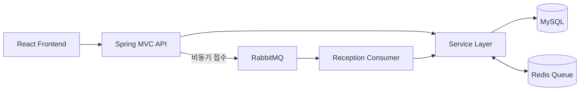

<div align="center">
  <h1>FORHOS Backend</h1>
  <p><strong>병원 접수와 대기열을 안정적으로 관리하는 REST API</strong></p>
  <p>회원 인증, 병원 정보, 진료 접수 및 실시간 대기 상태를 제공하는 Spring Boot 서버입니다.</p>

  <p>
    <a href="https://github.com/jinkong9/FORHOS"></a>
    <a href="https://github.com/jinkong9/FORHOS_Backend"></a>
    
    
    
    
    
  </p>
</div>

## Overview

FORHOS Backend는 프론트엔드가 병원 조회, 회원 관리, 진료 접수, 대기 현황 기능을 사용할 수 있도록 REST API를 제공합니다. JWT 기반 인증과 역할 검사를 적용하고, 병원별 대기열은 Redis를 우선 사용하며 Redis 작업에 실패하면 데이터베이스 조회로 처리합니다. 비동기 접수 생성은 RabbitMQ 메시지로 전달합니다.

## Features

- 회원가입, 로그인, 로그아웃, JWT 재발급 및 내 정보 관리
- 병원 목록과 상세 정보 조회
- 진료 접수 생성, 취소, 현재 상태와 내 접수 내역 조회
- Redis 기반 대기 번호 발급 및 대기열 조회, DB fallback
- RabbitMQ를 이용한 비동기 접수 생성
- 병원 관리자와 시스템 관리자의 역할 기반 접수 관리
- 증상 키워드 기반 진료과 추천
- Swagger UI를 통한 OpenAPI 문서 제공

## Tech Stack

| 분류 | 기술 |
| --- | --- |
| Language | Java 21 |
| Framework | Spring Boot 4.0.6, Spring Web MVC |
| Persistence | Spring Data JPA, Hibernate |
| Database | MySQL 8.4 |
| Queue / Cache | Redis 7, RabbitMQ 4 |
| Security | Spring Security, JWT, BCrypt |
| API Docs | Springdoc OpenAPI / Swagger UI |
| Build | Gradle |
| Tests | JUnit, Spring Boot Test, H2 |

## Getting Started

### 준비물

- Docker Desktop
- 프론트엔드와 백엔드 레포지토리를 같은 상위 폴더에 clone할 수 있는 Git

### 전체 개발 환경 실행

Docker Compose 설정은 프론트엔드 레포지토리에 있습니다. 두 저장소를 나란히 clone한 다음 프론트엔드 디렉터리에서 Compose를 실행하면 백엔드와 MySQL, Redis, RabbitMQ가 함께 시작됩니다.

```bash
mkdir forhos-local
cd forhos-local
git clone https://github.com/jinkong9/FORHOS.git
git clone https://github.com/jinkong9/FORHOS_Backend.git
cd FORHOS
docker compose up -d --build
```

백엔드 API 문서는 <http://localhost:8080/swagger-ui/index.html>에서 확인할 수 있습니다. 프론트엔드 설치, 실행 및 종료 방법은 [프론트엔드 로컬 개발 가이드](https://github.com/jinkong9/FORHOS/blob/main/docs/local-development.md)를 참고하세요.

### Gradle 명령어

JDK 21 환경에서 백엔드를 빌드하거나 테스트할 수 있습니다. 전체 실행에는 MySQL, Redis, RabbitMQ도 필요하므로 위의 Docker Compose 실행 방법을 사용하세요.

```bash
./gradlew build
./gradlew test
```

Windows PowerShell에서는 아래 명령을 사용합니다.

```powershell
.\gradlew.bat build
.\gradlew.bat test
```

## Architecture


```mermaid
flowchart LR
    FE[React Frontend] --> API[Spring MVC API]
    API --> SVC[Service Layer]
    SVC --> DB[(MySQL)]
    SVC <--> REDIS[(Redis Queue)]
    API -->|비동기 접수| EX[ RabbitMQ ]
    EX --> CON[Reception Consumer]
    CON --> SVC
```

Controller는 HTTP 요청과 응답을 처리하고, Service는 인증 회원 확인·접수 상태 전이·대기열 계산 등 도메인 로직을 수행합니다. Repository는 JPA를 통해 데이터를 관리합니다. 비동기 접수 요청은 RabbitMQ consumer가 받아 접수 생성 흐름으로 전달합니다.

## API Overview

| 영역 | 주요 API | 설명 |
| --- | --- | --- |
| Auth | `POST /api/auth/refresh` | refresh token 검증 및 토큰 재발급 |
| Member | `POST /api/members/register`, `POST /api/members/login` | 회원가입과 로그인 |
| Member | `GET/PATCH /api/members/myinfo` | 내 정보 조회와 수정 |
| Hospital | `GET /api/hospital`, `GET /api/hospital/{hospitalId}` | 병원 목록과 상세 조회 |
| Reception | `POST /api/reception` | 동기 접수 생성 |
| Reception | `POST /api/reception/async` | RabbitMQ 기반 비동기 접수 요청 |
| Reception | `GET /api/reception/me`, `GET /api/reception/me/latest` | 내 접수 목록과 최신 상태 |
| Reception | `GET /api/reception/hospital/{receptionId}/status` | 접수 상태와 앞 대기 인원 |
| Reception | `PATCH /api/reception/{receptionId}/cancel` | 본인 접수 취소 |
| Admin | `/api/admin/receptions/**` | 관리자 당일 접수 조회 및 상태 관리 |
| Recommendation | `POST /api/recommendations/departments` | 증상 기반 진료과 추천 |

전체 요청과 응답 스키마 및 인증 방법은 실행 후 [Swagger UI](http://localhost:8080/swagger-ui/index.html)에서 확인할 수 있습니다.

## Security

| 대상 | 접근 |
| --- | --- |
| 회원가입, 로그인, 병원 조회, Swagger | 공개 |
| 내 정보, 접수 생성·조회·취소 | 인증 사용자 |
| 관리자 API, 접수 호출·완료 | `HOSPITAL_ADMIN` 또는 `ADMIN` |
| 병원 관리자 계정 생성 및 회원 권한 변경 | `ADMIN` |

비밀번호는 BCrypt로 저장하며, 접수 상태 조회 시 요청한 회원이 접수 소유자인지 확인합니다. 개발 환경의 JWT 기본값은 로컬 실행용으로만 사용하세요.

## Configuration

애플리케이션은 환경 변수로 로컬 주소와 인증 정보를 바꿀 수 있습니다. 전체 Compose 실행 시 서비스 이름을 기준으로 연결 정보가 자동 설정됩니다.

| 변수 | 기본값 | 용도 |
| --- | --- | --- |
| `SPRING_DATASOURCE_URL` | `jdbc:mysql://localhost:3306/forhos...` | MySQL JDBC 주소 |
| `DB_USERNAME` | `ssafy` | MySQL 계정 |
| `DB_PASSWORD` | `ssafy` | MySQL 비밀번호 |
| `JWT_SECRET` | application 설정값 | JWT 서명 키 |
| `REDIS_HOST` / `REDIS_PORT` | `localhost` / `6379` | Redis 연결 |
| `RABBITMQ_HOST` / `RABBITMQ_PORT` | `localhost` / `5672` | RabbitMQ 연결 |
| `RABBITMQ_USERNAME` / `RABBITMQ_PASSWORD` | `guest` / `guest` | RabbitMQ 계정 |

JPA의 `ddl-auto=update` 설정이 로컬 데이터베이스의 테이블을 생성·갱신합니다. MySQL 서버와 Redis, RabbitMQ는 별도로 실행해야 하며, 가장 간단한 방법은 프론트엔드 레포지토리에서 `docker compose up -d --build`를 실행하는 것입니다.

## Tests

```bash
./gradlew test
```

테스트는 H2 기반 스키마 검증, 인증·권한, 회원과 의료 프로필, 접수 처리, 관리자 API, 증상 추천 서비스 등을 다룹니다.

## Related Repositories

- [FORHOS Frontend](https://github.com/jinkong9/FORHOS)
- [로컬 개발 환경 실행 안내](https://github.com/jinkong9/FORHOS/blob/main/docs/local-development.md)
